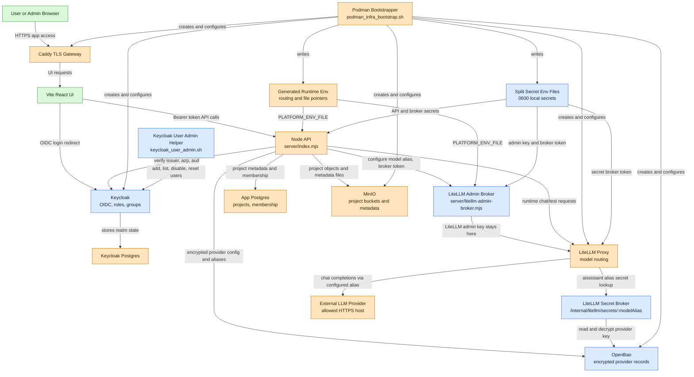

# Component Interactions

This graph highlights the main AIssistAInt components, their trust boundaries, and the data or secret flows between them.

Color guide:

- Green: user-facing UI and browser entry points.
- Orange: long-running or persistent runtime components.
- Blue: identity, secret, broker, and administrative security controls.

## Key Interaction Notes

- Browser-to-API calls use Keycloak bearer tokens; the API verifies issuer and client audience/azp before processing protected routes.
- Provider API keys are write-only from the UI perspective. The API encrypts them and stores encrypted records in OpenBao.
- The API does not hold the LiteLLM admin key directly. It asks the LiteLLM admin broker to configure model aliases with a dedicated broker token.
- LiteLLM receives `aissistaint://` secret references. It resolves them through the API secret broker, which validates aliases and decrypts provider keys from OpenBao.
- External LLM provider access is constrained by the configured endpoint policy: HTTPS by default, host allowlist, and private-address blocking unless explicit dev flags are enabled.
- The bootstrapper owns local service wiring and writes runtime env pointers separately from high-sensitivity secret env files.

## Primary Trust Boundaries

- Browser and public HTTPS gateway
- API and internal service network
- API and OpenBao secret store
- API and LiteLLM admin broker
- LiteLLM and API secret broker
- Local generated runtime env files and local secret env files
